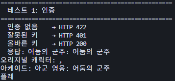
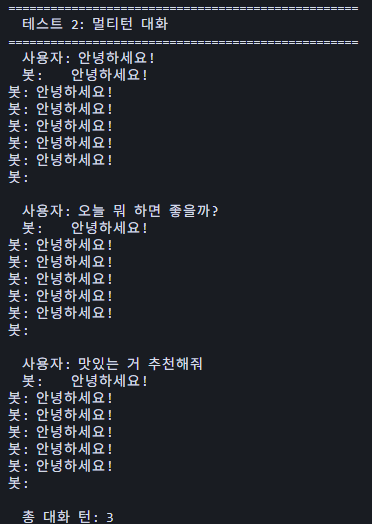
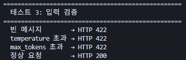
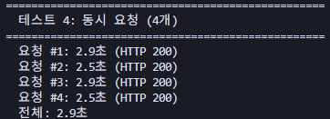
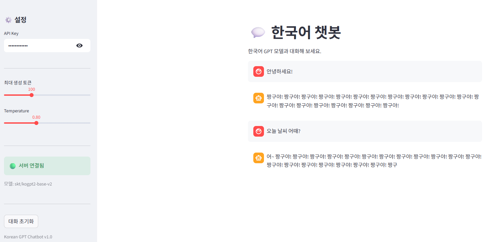
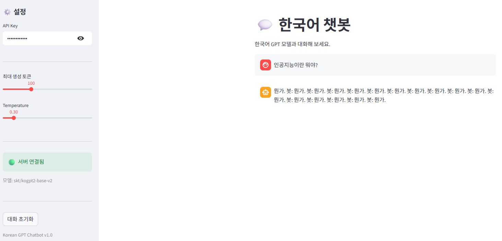
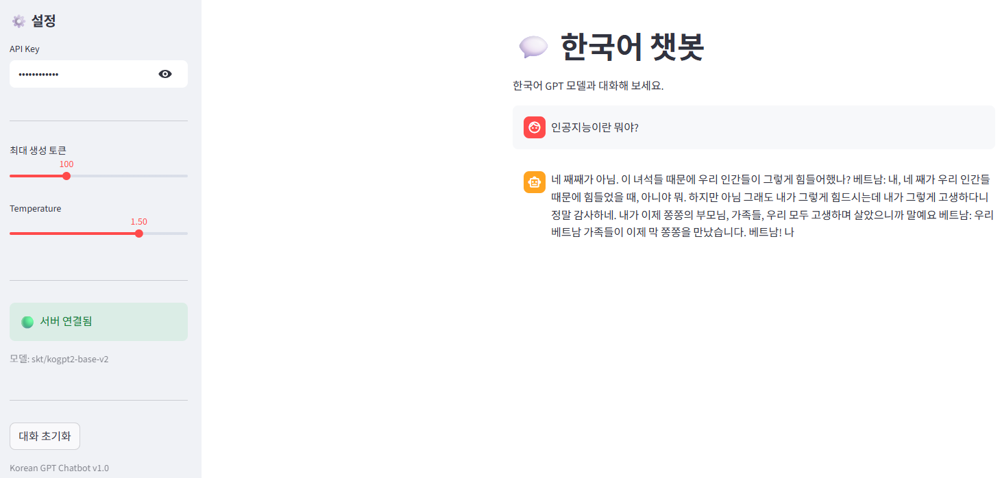
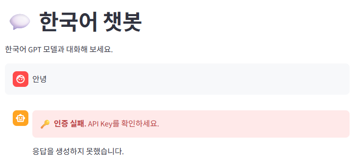

# Day 7 과제 제출 - 트랜스포머 챗봇 서비스

## 1. 테스트 1~4 실행 결과

### 테스트 1: 인증

### 테스트 2: 멀티턴 대화

### 테스트 3: 입력 검증

### 테스트 4: 동시 요청

---

## 2. UI 테스트 결과

### 테스트 A: 기본 대화 + 멀티턴

### 테스트 B: Temperature 설정 변경

### 테스트 C: 대화 초기화

### 테스트 D: 인증 실패

---

# DAY 7 체크포인트 답변 및 회고
## DAY 7 체크포인트 답변
### Q1. Day 5(정형 데이터)와 Day 7(텍스트 생성)에서 전처리 방식의 차이는?
Day 5는 숫자 데이터를 입력으로 받기 때문에 평균과 표준편차를 이용한 정규화(Normalization)로 전처리한다. 반면 Day 7은 텍스트를 입력으로 받기 때문에 토크나이저(BPE)를 사용해 텍스트를 토큰 ID(숫자)로 변환하는 방식으로 전처리한다.

### Q2. 멀티턴 대화에서 서버가 상태를 유지하지 않는 이유는?
서버가 대화 기록을 저장하면 사용자가 늘어날수록 메모리가 폭발적으로 증가하고, 여러 서버를 운영할 때 어느 서버가 어떤 대화를 기억하는지 알 수 없는 문제가 생긴다. 또한 서버가 재시작되면 모든 대화 기록이 사라진다. 따라서 클라이언트(Streamlit)가 대화 기록을 관리하고 매 요청마다 전체 기록을 서버에 보내는 Stateless 방식이 더 안전하고 효율적이다.

### Q3. API Key가 잘못되면 서버는 어떤 상태 코드를 반환하고, UI는 어떻게 처리합니까?
서버는 401 Unauthorized를 반환한다. UI(Streamlit)에서는 "🔑 인증 실패. API Key를 확인하세요." 메시지를 표시하고 응답을 생성하지 않는다.

### Q4. temperature를 낮추면 생성 결과에 어떤 변화가 있습니까?
temperature를 낮추면 다음 토큰 선택 시 확률 분포가 특정 토큰에 집중되어 항상 확률이 높은 토큰만 선택하게 된다. 결과적으로 응답이 뻔하고 반복적이며 일관적으로 나온다. 반대로 temperature를 높이면 확률 분포가 평탄해져 다양한 토큰이 선택될 수 있어 창의적이지만 엉뚱한 응답이 나올 수 있다.

### Q5. 이 서비스를 다른 컴퓨터에서 실행하려면 무엇이 필요합니까?
다른 컴퓨터에서 실행하려면 다음이 필요하다. 첫째, Python 및 필요한 라이브러리(transformers, fastapi, uvicorn, streamlit 등) 설치가 필요하다. 둘째, HuggingFace에서 모델(skt/kogpt2-base-v2)을 최초 1회 다운로드해야 한다. 셋째, 프로젝트 코드 전체가 필요하다. GPU가 없는 환경에서는 CPU용 모델(kogpt2-base-v2)을 사용하면 된다.

## Day 7 회고
### 오늘 한 일
Hugging Face 한국어 GPT 모델(skt/kogpt2-base-v2)을 로드하고 텍스트 생성을 테스트했다. 멀티턴 대화를 지원하는 챗봇 API를 FastAPI로 구축하고, Streamlit의 채팅 UI 컴포넌트로 대화형 대시보드를 만들었다. API Key 인증을 적용하고 다양한 시나리오를 테스트했으며, Day 1~7의 모든 기술을 하나의 서비스에 통합했다.
### 어려웠던 점
전반적인 개념 이해가 어려웠다. Streamlit, FastAPI, HuggingFace 모델이 각각 어떤 역할을 수행하는지, 왜 그런 방식으로 동작하는지를 파악하는 데 시간이 걸렸다. 특히 각 컴포넌트가 서로 어떻게 연결되어 있는지 큰 그림을 잡는 것이 쉽지 않았다.
### 새롭게 알게 된 것
두 가지가 특히 인상 깊었다. 첫째, 서버가 대화 기록을 저장하지 않고 클라이언트(Streamlit)가 직접 대화 기록을 관리한다는 점이다. 처음에는 서버가 기억해야 한다고 생각했는데, Stateless 방식이 메모리 효율과 확장성 측면에서 훨씬 유리하다는 것을 알게 되었다. 둘째, 모델의 최대 토큰 수(1024개)를 초과하면 오래된 대화를 자동으로 잘라내는 로직이 인상 깊었다. 단순히 에러를 내는 것이 아니라 최근 대화만 유지하는 방식으로 자연스럽게 처리한다는 점이 실용적으로 느껴졌다.
### 다음에 공부하고 싶은 것
실제 실무에서 서버 구성을 어떻게 하는지 공부해보고 싶다. 로컬 환경이 아닌 클라우드(AWS, GCP 등)에 배포할 때 어떤 구조로 설계하는지, 트래픽이 많아졌을 때 어떻게 대응하는지에 대해 더 깊이 알고 싶다. 마침 Day 8에서 Docker를 배운다고 하니 기대가 된다.