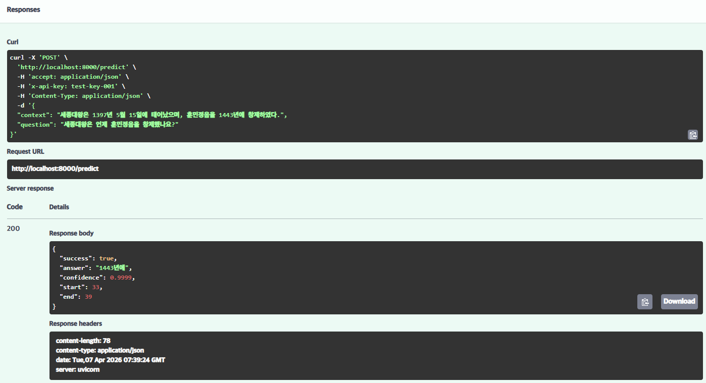
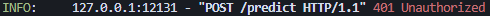
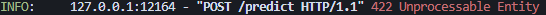
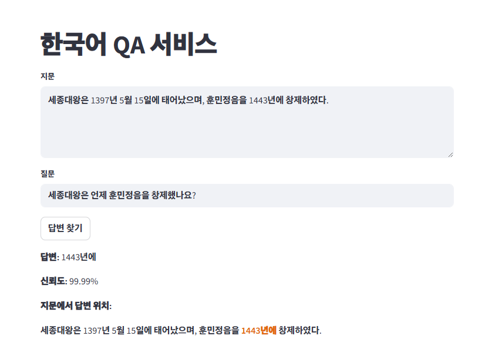

# Day 8 — 자율 프로젝트: 나만의 모델 서빙 서비스

## 1. 프로젝트 개요

- **도메인**: 한국어 QA (Question Answering)
- **모델**: `monologg/koelectra-base-v3-finetuned-korquad`
- **모델 선택 이유**: KorQuAD 데이터셋으로 파인튜닝된 한국어 QA 특화 모델로, CPU 환경에서도 빠른 추론이 가능하고 `pipeline()`으로 즉시 사용 가능

## 2. 프로젝트 구조
qa-service/
├── app/
│   ├── init.py
│   ├── auth.py          # API Key 인증 (Day 6 재사용)
│   ├── schemas.py       # Pydantic 입출력 검증
│   ├── model_service.py # 모델 로드 + 추론
│   └── main.py          # FastAPI 서버
├── frontend/
│   └── app.py           # Streamlit UI
├── .env                 # HuggingFace 토큰 (Git 제외)
├── .gitignore
└── requirements.txt
## 3. 평가 기준 충족 여부

| 평가 기준 | 결과 |
|-----------|------|
| 서버가 정상적으로 실행되는가? | ✅ |
| Swagger UI에서 추론이 동작하는가? | ✅ |
| API Key 없이 요청하면 401이 반환되는가? | ✅ |
| 잘못된 입력에 적절한 에러 메시지가 나오는가? | ✅ |
| Streamlit UI에서 입력 → 결과 확인이 가능한가? | ✅ |

## 4. 테스트 결과

### 4.1 Swagger UI 정상 추론 (200 OK)

### 4.2 API Key 없이 요청 시 401

### 4.3 잘못된 입력 시 422

### 4.4 Streamlit UI 결과

## 5. 발표

### 5.1 기술적으로 어려웠던 부분
- `transformers 5.5.0`에서 `"question-answering"` 태스크가 지원 목록에서 제외되어 4.40.0으로 다운그레이드 필요
- Windows 환경에서 `huggingface-cli` 미인식 → `.env` + `python-dotenv`로 해결
- `auth.py`에서 `Header(...)`를 `Header(None)`으로 변경해야 401이 정상 반환됨

### 5.2 Day 1~7 학습이 어떻게 연결되었는가
- Day 1~3: FastAPI 기초, Pydantic 검증, `run_in_executor` → `main.py`에 적용
- Day 4~5: Streamlit UI, 전체 서비스 구조 → `frontend/app.py`에 적용
- Day 6: API Key 인증 `auth.py` → 그대로 재사용
- Day 7: HuggingFace 모델 로드 패턴 → `model_service.py`에 적용

## 6. 회고

### 잘된 점
- Day 1~7의 기술을 하나의 서비스로 통합하는 전체 사이클을 직접 경험
- `.env`로 토큰을 관리하는 보안 습관 적용
- `Header(None)` vs `Header(...)` 차이를 직접 디버깅하며 이해

### 어려웠던 점
- 로컬 Windows 환경 특유의 문제(인코딩, PowerShell 문법, symlink 경고)가 예상보다 많았음
- 라이브러리 버전 충돌(`transformers 5.5.0`) 원인 파악에 시간이 걸렸음

### 다음에 발전시키고 싶은 부분
- 지문을 한 번 입력하면 `st.session_state`에 저장해두고 질문만 바꿔가며 여러 번 답변을 찾을 수 있도록 개선
- Docker로 패키징해서 어느 환경에서도 동일하게 실행 가능하도록 구성 (MLOps 과정에서 예정)

## 7. Day 8 체크포인트 답변

**Q1. Pydantic 스키마를 사용하면 잘못된 입력을 어떻게 막을 수 있나요?**

Pydantic의 `Field`에 `min_length`, `max_length`를 설정하면 요청이 들어올 때 FastAPI가 자동으로 검증한다. 너무 짧은 입력이나 모델 토큰 한도를 초과하는 긴 입력을 차단하고, 검증 실패 시 422 에러를 자동으로 반환해서 모델까지 잘못된 값이 전달되는 것을 막는다.

**Q2. `Depends(verify_api_key)`를 사용하는 이유가 무엇인가요?**

`/predict` 엔드포인트 실행 전에 반드시 API Key 검증을 거치도록 강제한다. Key가 없거나 틀리면 추론 실행 전에 401을 반환하고, 인증 로직을 별도 함수로 분리해서 여러 엔드포인트에서 재사용할 수 있다.

**Q3. `run_in_executor`를 사용하는 이유가 무엇인가요?**

모델 추론처럼 시간이 오래 걸리는 작업을 메인 이벤트 루프에서 실행하면 그동안 다른 요청을 받지 못한다. `run_in_executor`를 사용하면 무거운 작업을 별도 스레드(ThreadPoolExecutor)에 위임해서 메인 이벤트 루프는 계속 다른 요청을 받을 수 있다.

**Q4. Day 1~8 중 가장 핵심이 되는 Day는 어디라고 생각하나요?**

Day 5가 가장 핵심이라고 생각한다. PyTorch 모델 → FastAPI 서버 → Streamlit 프론트엔드로 이어지는 전체 서비스 사이클을 처음으로 직접 구현해봤기 때문이다. Day 1~4에서 배운 개념들이 Day 5에서 하나로 합쳐지면서 각 기술이 어떻게 연결되는지 실제로 체감할 수 있었고, 그 구조가 Day 8 자율 프로젝트의 뼈대가 됐다.

**Q5. 이 서비스를 더 발전시킨다면 어떤 기능을 추가하고 싶나요?**

지금은 질문을 여러 개 하려면 매번 지문을 다시 입력해야 해서 비효율적이다. 지문을 한 번 입력하면 `st.session_state`에 저장해두고, 이후 질문만 바꿔가며 여러 번 답변을 찾을 수 있도록 개선하고 싶다.